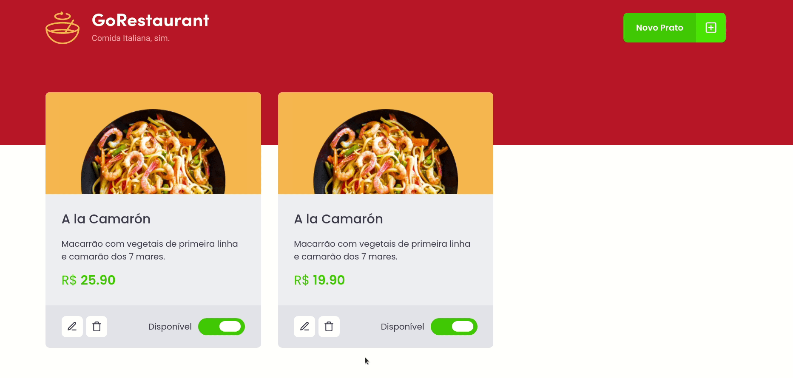

<div>
  <h1 align="center">GOORESTAURANTE</h1>
  
  <div align="center">

  <a href="#sobre">Sobre</a> 
    |
  <a href="#tecnologias">Tecnólogias</a>
    |
  <a href="#dependencias">Utilizar projeto</a>
    |
  <a href="#Projeto">Pagina do projeto</a>

  </div>
</div>

<div >
<ul align="center">
  
    
</ul>

</div>


<div>
  <h3>Sobre.</h3>
  <h4 id="sobre">
  <b>Desenvolvido com REACT,</b>
  Projeto era de migração para uma aplicação desenvolvida em Class componentes e JS, foram feitas mudanças na inclusão de TYPESCRIPT para tipagem dos componentes e uso de HOOKS ao invés de CLASS.</h4>

  
</div>


<div id="tecnologias">
  <h3>Tecnológias.</h3>
  <ul>
    <li>
      <a href="https://pt-br.reactjs.org/docs/getting-started.html">REACT.Js
      </a>
    </li>
    <li>
      <a href="https://styled-components.com/">    
        Styled-Componentes.
      </a>
    </li>
    <li>
      <a href="https://www.typescriptlang.org/">
        TypeScript.
      </a>
    </li>
    <li>
      <a href="https://nodejs.org/pt-br/docs/">
        NODE.JS.
      </a>
    </li>
    <li>
      <a href="https://classic.yarnpkg.com/en/docs/">
        YARN.
      </a>
    </li>
  </ul>
  
</div>

<div id="dependencias">
<h3>Baixar Projeto.</h3>  

```bash
# Clone this repository
$ git clone https://github.com/FullBarbosa/gorestaurante.git

# Install dependencies Yarn
$ yarn install

# Install dependencies NPM
$ npm install 
```
</div>

<div>

<h3>Como utilizar.</h3>  

```bash
# Start do servidor
$ npm server
$ yarn server

# Iniciar aplicação
$ npm start
$ yarn start

```
</div>